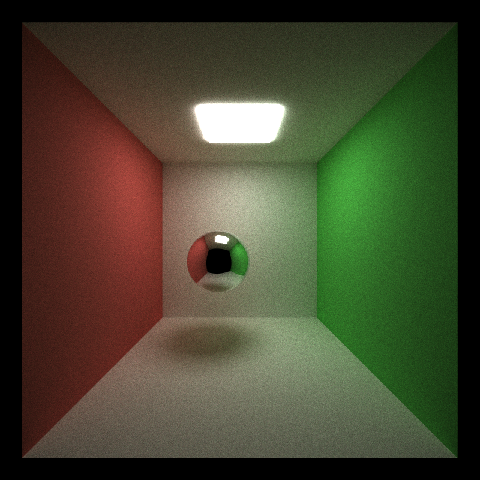
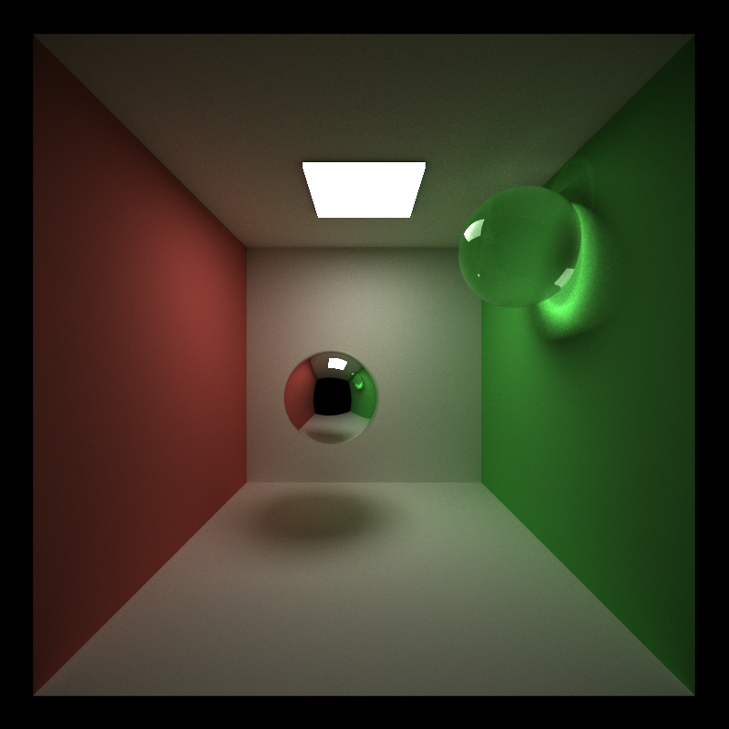

# CUDA Path Tracer

**University of Pennsylvania, CIS 565: GPU Programming and Architecture, Project 3**

* **Name:** Yingxuan Hu
* **LinkedIn:** [linkedin.com/in/yingxuan-hu-bbb9b3380](https://www.linkedin.com/in/yingxuan-hu-bbb9b3380/)
* **Tested on:** Windows 11, Intel(R) Core(TM) i9-14900HX @ 2.20 GHz, NVIDIA GeForce RTX 5070 Ti Laptop GPU (12 GB)
* **Computer:** Personal Computer
* **Compute Capability:** 12.0 (`sm_120`)

## Part 1 - Core Features

This project implements a CUDA-based Monte Carlo path tracer with multi-bounce light transport.

The required core features include:

* **Diffuse Path Tracing:** Ideal diffuse BSDF evaluation using cosine-weighted hemisphere sampling.
* **Multi-Bounce Light Transport:** Rays continue through multiple surface interactions until termination or the maximum trace depth is reached.
* **Stream Compaction:** Terminated paths are removed after each bounce so later kernels only process active paths.
* **Material Sorting:** Active paths and their corresponding intersections can be sorted by material type before shading.
* **Stochastic Antialiasing:** Primary camera rays are randomly jittered within each pixel.

### Basic Render



The image above shows the current path tracer rendering the Cornell box with multi-bounce lighting.

## Part 2 - Additional Features

The renderer also includes the following additional features:

* **Refraction**
* **Depth of Field**
* **Direct Lighting**
* **Motion Blur**
* **Russian Roulette**

These features total **10 points**.

### Refraction

Refractive materials use Snell's law to compute transmitted rays.

Schlick's approximation is used to estimate Fresnel reflectance and probabilistically choose between reflection and refraction. Total internal reflection is also handled.


### Depth of Field

Depth of field is implemented using a thin-lens camera model.

Each primary ray samples a random point on the aperture and is redirected toward the focal plane. Objects near the focal distance remain sharper while objects farther from the focal plane become blurred.


### Direct Lighting

Direct lighting is implemented by sampling points on emissive area lights and casting visibility rays toward the sampled positions.

This improves convergence by allowing diffuse surfaces to receive direct illumination without relying only on random BSDF paths to eventually hit a light source.



### Motion Blur

Motion blur is implemented by assigning each primary path a random time within a normalized shutter interval.

Objects can define a velocity, and their position varies over time according to:

`position(t) = initialPosition + velocity * t`

The same time value is preserved throughout the entire path so that primary rays, secondary rays, and shadow rays all evaluate a consistent scene state.


### Russian Roulette

Russian roulette probabilistically terminates low-contribution paths after several bounces.

The survival probability is based on the current path throughput. Paths that survive have their throughput divided by the survival probability so that the estimator remains unbiased.

## Performance Analysis

Detailed performance analysis, plots, and feature comparisons will be added in the final README.

This will include:

* Stream compaction behavior across bounce depth.
* Open-scene versus closed-scene stream compaction performance.
* Material sorting enabled versus disabled.
* Russian roulette enabled versus disabled.
* Performance impact of the additional rendering features.

## Build Note

I modified both the root `CMakeLists.txt` and `stream_compaction/CMakeLists.txt` to support the current Windows, CUDA, and stream compaction build configuration.

### Root `CMakeLists.txt`

The project remains configured with both CUDA and C++:

```cmake
project(cis565_path_tracer LANGUAGES CUDA CXX)
```

For compatibility with CUDA 13.3 and Visual Studio 2022/MSVC, I added the traditional preprocessor option for CUDA compilation:

```cmake
if(MSVC)
    target_compile_options(${CMAKE_PROJECT_NAME} PRIVATE
        "$<$<COMPILE_LANGUAGE:CUDA>:-Xcompiler=/Zc:preprocessor>"
    )
endif()
```

The stream compaction subdirectory was enabled:

```cmake
add_subdirectory(stream_compaction)
```

The `stream_compaction` library was also linked to the main path tracer target:

```cmake
target_link_libraries(${CMAKE_PROJECT_NAME}
    ${GL_LIBRARIES}
    stream_compaction
)
```

### `stream_compaction/CMakeLists.txt`

The stream compaction source and header files were explicitly added to the library target:

```cmake
set(headers
    common.h
    cpu.h
    efficient.h
    naive.h
    thrust.h
)

set(sources
    common.cu
    cpu.cu
    efficient.cu
    naive.cu
    thrust.cu
)
```

The library is built with:

```cmake
add_library(stream_compaction ${sources} ${headers})
```

I also corrected the malformed target name in the CUDA architecture configuration:

```cmake
set_target_properties(stream_compaction PROPERTIES CUDA_ARCHITECTURES OFF)
```

The existing CUDA architecture selection logic and Debug/Release CUDA compile options were preserved.

Finally, the same MSVC preprocessor compatibility option was added to the `stream_compaction` target:

```cmake
if(MSVC)
    target_compile_options(stream_compaction PRIVATE
        "$<$<COMPILE_LANGUAGE:CUDA>:-Xcompiler=/Zc:preprocessor>"
    )
endif()
```