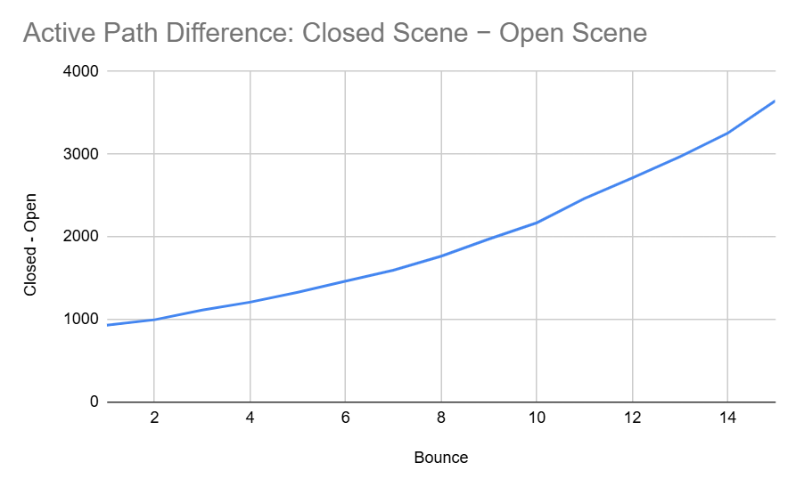
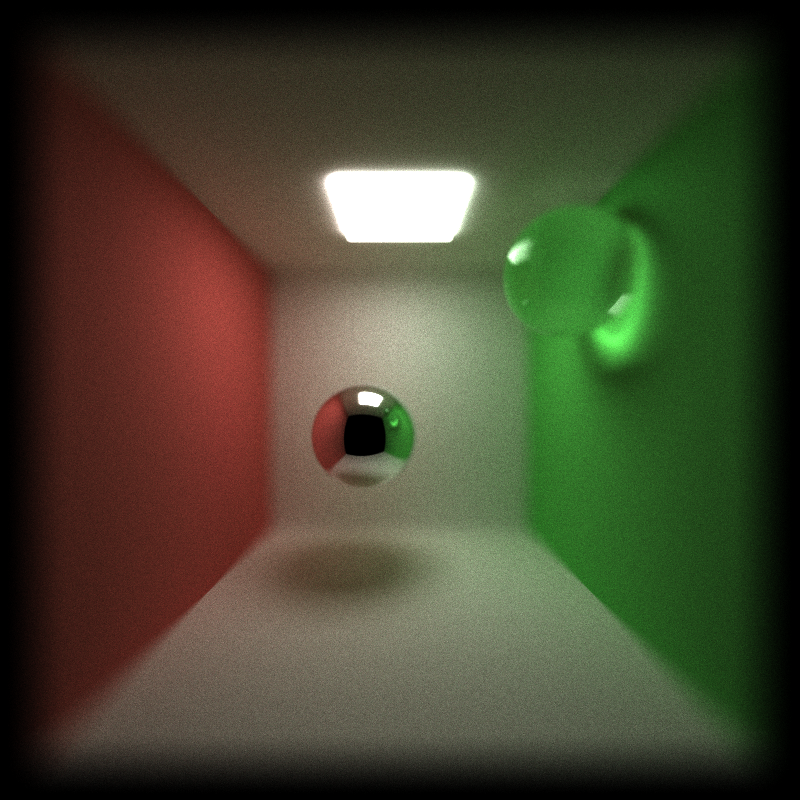
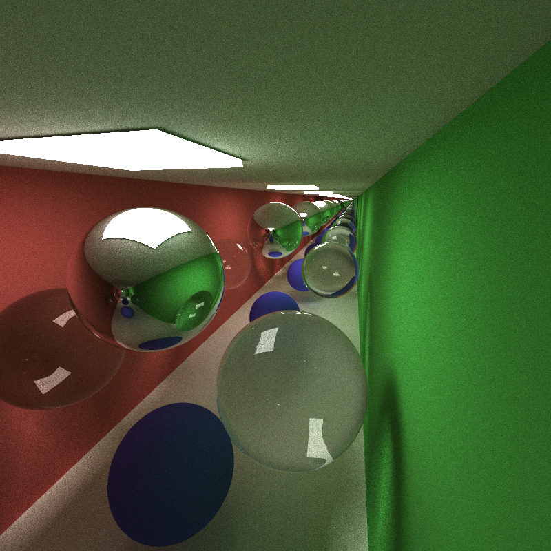
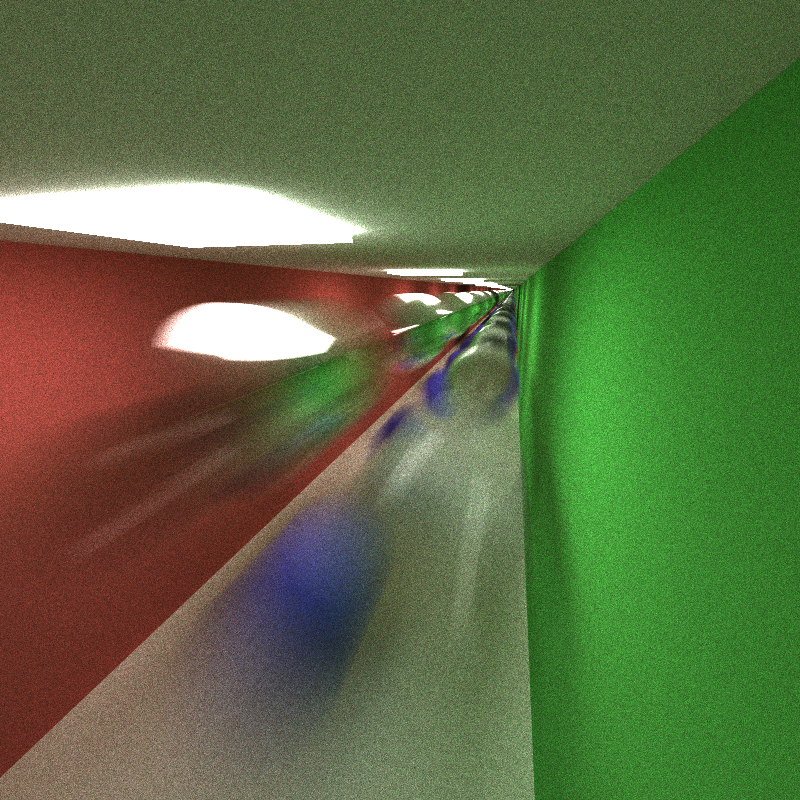
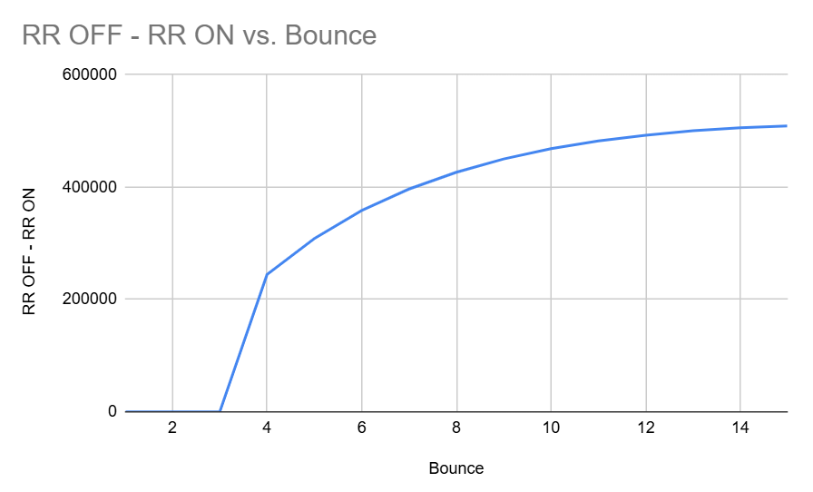

# CUDA Path Tracer

**University of Pennsylvania, CIS 565: GPU Programming and Architecture, Project 3**

* **Name:** Yingxuan Hu
* **LinkedIn:** [linkedin.com/in/yingxuan-hu-bbb9b3380](https://www.linkedin.com/in/yingxuan-hu-bbb9b3380/)
* **Tested on:** Windows 11, Intel(R) Core(TM) i9-14900HX @ 2.20 GHz, NVIDIA GeForce RTX 5070 Ti Laptop GPU (12 GB)
* **Computer:** Personal Computer
* **CUDA Toolkit:** 13.3
* **Compute Capability:** 12.0 (`sm_120`)

This project implements a CUDA-based Monte Carlo path tracer with multi-bounce light transport, stochastic antialiasing, stream compaction, material sorting, refraction, depth of field, direct lighting, motion blur, and Russian roulette path termination.

## Part 1 - Core Features

### Basic Path Tracing

The renderer supports multi-bounce light transport with ideal diffuse, perfect specular, and refractive materials. Diffuse surfaces use cosine-weighted hemisphere sampling, while primary rays are randomly jittered within each pixel for stochastic antialiasing.

The render above is used as the baseline image for the additional rendering features.

### Stream Compaction

After each bounce, terminated paths are removed so that later CUDA kernels only process paths that are still active.

The figure above shows the difference in active path count between the closed and open corridor scenes at each bounce. The difference increases gradually with bounce depth, indicating that the closed scene retains more paths over time because fewer rays are able to escape through the end of the corridor.

**Open Scene Active Paths**

- Bounce 1: 625019
- Bounce 2: 614187
- Bounce 3: 607416
- Bounce 4: 601011
- Bounce 5: 595298
- Bounce 6: 589689
- Bounce 7: 584294
- Bounce 8: 578845
- Bounce 9: 573552
- Bounce 10: 568261
- Bounce 11: 562931
- Bounce 12: 557581
- Bounce 13: 552420
- Bounce 14: 547261
- Bounce 15: 541891
- Bounce 16: 0

**Closed Scene Active Paths**

- Bounce 1: 625950
- Bounce 2: 615184
- Bounce 3: 608530
- Bounce 4: 602221
- Bounce 5: 596628
- Bounce 6: 591153
- Bounce 7: 585890
- Bounce 8: 580611
- Bounce 9: 575525
- Bounce 10: 570431
- Bounce 11: 565397
- Bounce 12: 560294
- Bounce 13: 555390
- Bounce 14: 550516
- Bounce 15: 545539
- Bounce 16: 0

The number of active paths decreases gradually as paths either leave the scene or terminate during tracing. The closed scene consistently retains slightly more active paths than the open scene because the additional end wall prevents some rays from escaping through the corridor.

The difference becomes more visible at later bounces. For example, at bounce 15, the open scene has 541891 active paths while the closed scene still has 545539. The final value becomes zero at bounce 16 because the renderer reaches the configured maximum trace depth and terminates the remaining paths.

Stream compaction becomes more useful as paths terminate because later CUDA kernels operate only on the surviving paths instead of continuing to launch threads for paths that are already inactive.

| Scene | Stream Compaction OFF | Stream Compaction ON |
| --- | ---: | ---: |
| Open | 309.177 s | 280.436 s |
| Closed | 317.782 s | 286.991 s |

In the open scene, enabling stream compaction reduced the total render time from 309.177 seconds to 280.436 seconds, an improvement of about 9.3%. In the closed scene, the render time decreased from 317.782 seconds to 286.991 seconds, an improvement of about 9.7%.

The two scenes show a similar overall benefit from compaction. Although the closed scene retains slightly more active paths, enough paths still terminate during tracing for compaction to reduce the amount of work performed by later kernels.

Stream compaction is not free because removing terminated paths requires an additional compaction operation after each bounce. Its benefit therefore depends on whether the reduction in later kernel work is large enough to compensate for this overhead. In this scene, the reduction in inactive-path processing is sufficient to produce a measurable performance improvement in both the open and closed cases.

### Material Sorting

Before shading, active paths and their corresponding intersections can be sorted by material type. This places paths using similar BSDF logic closer together and can reduce branch divergence inside the shading kernel.

| Material Sorting | Render Time | Average Time / Iteration |
| --- | ---: | ---: |
| OFF | 286.991 s | 0.286991 s |
| ON | 440.213 s | 0.440213 s |

In this scene, enabling material sorting increased the total render time from 286.991 seconds to 440.213 seconds, an increase of about 53.4%. Therefore, material sorting did not provide a performance improvement for this workload.

Although grouping paths by material can reduce branch divergence during shading, sorting also introduces additional work every bounce. In this scene, the cost of generating material keys and sorting the active paths is larger than the benefit gained from improved material coherence.

One likely reason is that the shading work for each path is relatively small compared with the sorting overhead. The scene also contains only a limited number of material types, while ray-scene intersection remains a major part of the total rendering cost. As a result, reducing divergence in the shading kernel does not compensate for the additional sorting operation.

Material sorting may become more useful in scenes with more complex material evaluation, a larger variety of materials, or a rendering pipeline where shading accounts for a larger fraction of the total execution time.

## Part 2 - Additional Features

* **Refraction**
* **Depth of Field**
* **Direct Lighting**
* **Motion Blur**
* **Russian Roulette** 

### Refraction

Refractive materials use Snell's law to generate transmitted rays. Schlick's approximation is used to estimate Fresnel reflectance and probabilistically choose between reflection and refraction. Total internal reflection is also handled.

The glass spheres visible in the basic render demonstrate the refraction implementation. They refract the colored walls and nearby geometry behind them, while Fresnel reflection becomes stronger at grazing angles.

| Refraction | Render Time | Average Time / Iteration |
| --- | ---: | ---: |
| OFF | 284.747 s | 0.284747 s |
| ON | 286.991 s | 0.286991 s |

Enabling refraction increased the total render time from 284.747 seconds to 286.991 seconds for 1000 iterations, an increase of only about 0.8%. For this scene, the additional computation required for refraction therefore has very little effect on the overall rendering time.

Refraction adds Snell's law evaluation, Fresnel probability calculation, and a reflection/refraction branch at refractive surface interactions. However, these operations are relatively inexpensive compared with the repeated ray-scene intersection work performed throughout the path tracer. The refractive objects also occupy only part of the scene, so most paths do not execute the refractive branch at every bounce.

The refraction calculation maps naturally to GPU execution because each path independently evaluates its next direction. One possible source of inefficiency is divergence when neighboring paths make different reflection or refraction decisions.

No feature-specific acceleration was added for refraction. A future implementation could combine material grouping with a spatial acceleration structure such as a BVH to reduce the much larger cost of subsequent ray intersections.

### Depth of Field

Depth of field is implemented using a thin-lens camera model. Each primary ray samples a random position on the aperture and is redirected toward the focal plane.

The long corridor contains objects at many different distances from the camera, making the depth-of-field effect visible across the scene. Objects near the focal distance remain relatively sharp while objects farther away become blurred.

| Depth of Field | Render Time | Average Time / Iteration |
| --- | ---: | ---: |
| OFF | 286.991 s | 0.286991 s |
| ON | 288.541 s | 0.288541 s |

Enabling depth of field increased the total render time from 286.991 seconds to 288.541 seconds for 1000 iterations, an increase of only about 0.5%. This shows that the depth-of-field implementation adds very little computational overhead in this renderer.

The additional work is mainly limited to sampling a point on the aperture and performing several vector operations when generating each primary ray. Once the primary ray has been generated, the rest of the path tracing process remains unchanged.

This operation maps well to GPU execution because each pixel sample independently generates its own lens ray and does not require additional synchronization between threads.

No feature-specific acceleration was added for depth of field. Possible extensions include different aperture shapes, improved lens sampling, or adaptive sampling in heavily blurred regions.

### Direct Lighting

Direct lighting is implemented by randomly sampling emissive area lights and casting visibility rays from diffuse surface intersections toward the sampled positions.

The corridor contains multiple area lights separated along its length. Direct-light sampling allows nearby diffuse surfaces to receive light without relying only on random BSDF paths to eventually reach an emissive surface, which improves convergence in illuminated regions.

| Direct Lighting | Render Time | Average Time / Iteration |
| --- | ---: | ---: |
| OFF | 286.991 s | 0.286991 s |
| ON | 546.393 s | 0.546393 s |

Enabling direct lighting increased the total render time from 286.991 seconds to 546.393 seconds for 1000 iterations, which is about a 90.4% increase in execution time. This additional cost comes mainly from sampling an emissive light and performing an extra shadow-ray visibility test for diffuse surface interactions.

Although each iteration becomes more expensive, direct lighting greatly improves convergence because diffuse surfaces can receive illumination directly instead of waiting for randomly scattered paths to eventually hit an emissive object. This provides a useful tradeoff between per-iteration cost and image convergence.

The shadow-ray calculations are independent for different paths and therefore fit GPU parallel execution well. However, the current implementation performs naive intersection testing against scene geometry for each visibility ray, which makes the additional shadow rays relatively expensive.

No dedicated acceleration was added for direct lighting. A future implementation could use a BVH or another spatial acceleration structure to reduce the cost of shadow-ray intersection tests. More advanced light importance sampling or multiple importance sampling could also improve sampling efficiency.

### Motion Blur

Motion blur is implemented by assigning each primary path a random time within a normalized shutter interval.

Objects can define a velocity, and their position varies according to:

`position(t) = initialPosition + velocity * t`

The same sampled time is preserved throughout the path so that primary rays, secondary rays, and shadow rays evaluate a consistent scene state.

Several spheres in the corridor use non-zero velocities, making their motion visible over the shutter interval.

| Motion Blur | Render Time | Average Time / Iteration |
| --- | ---: | ---: |
| OFF | 286.991 s | 0.286991 s |
| ON | 288.229 s | 0.288229 s |

Enabling motion blur increased the total render time from 286.991 seconds to 288.229 seconds for 1000 iterations, an increase of only about 0.4%. In this scene, motion blur therefore adds very little overall performance overhead.

The additional cost comes from sampling a time value for each path and evaluating moving objects at their time-dependent positions during intersection tests. Since the current implementation only supports translational motion, the extra computation per intersection remains small.

The same sampled time is reused throughout each path, so primary rays, secondary rays, and shadow rays all evaluate a consistent scene state. Different paths remain independent, which makes the approach well suited to GPU parallel execution.

No feature-specific acceleration was added for motion blur. Future improvements could include motion-aware bounding volumes, rotational motion, deformation blur, and acceleration structures that account for object motion over the shutter interval.

### Russian Roulette

Russian roulette probabilistically terminates low-contribution paths after several bounces. The survival probability is based on the current path throughput.

Paths that survive have their throughput divided by the survival probability so that the estimator remains unbiased.

| Russian Roulette | Render Time | Average Time / Iteration |
| --- | ---: | ---: |
| OFF | 286.991 s | 0.286991 s |
| ON | 133.929 s | 0.133929 s |

**Russian Roulette OFF Active Paths**

- Bounce 1: 625950
- Bounce 2: 615184
- Bounce 3: 608530
- Bounce 4: 602221
- Bounce 5: 596628
- Bounce 6: 591153
- Bounce 7: 585890
- Bounce 8: 580611
- Bounce 9: 575525
- Bounce 10: 570431
- Bounce 11: 565397
- Bounce 12: 560294
- Bounce 13: 555390
- Bounce 14: 550516
- Bounce 15: 545539
- Bounce 16: 0

**Russian Roulette ON Active Paths**

- Bounce 1: 625950
- Bounce 2: 615184
- Bounce 3: 608530
- Bounce 4: 357719
- Bounce 5: 288004
- Bounce 6: 232789
- Bounce 7: 189258
- Bounce 8: 154157
- Bounce 9: 125383
- Bounce 10: 102045
- Bounce 11: 83126
- Bounce 12: 67821
- Bounce 13: 55143
- Bounce 14: 44983
- Bounce 15: 36676
- Bounce 16: 0

Enabling Russian roulette reduced the total render time from 286.991 seconds to 133.929 seconds for 1000 iterations, a reduction of about 53.3%. This is a large performance improvement because Russian roulette directly reduces the number of paths that later bounces need to process.

The active path counts are identical through bounce 3 because Russian roulette begins after the first few bounces. Starting at bounce 4, the difference becomes significant. Without Russian roulette, 602221 paths remain active at bounce 4, while only 357719 remain when Russian roulette is enabled. By bounce 15, the number of active paths is reduced from 545539 to only 36676.

The closed corridor is useful for this comparison because paths are less likely to escape the scene naturally. This leaves more long paths for Russian roulette to terminate and makes its effect on later bounce workloads easier to observe.

On the GPU, the random termination decision itself is inexpensive. The main performance benefit comes from stream compaction removing terminated paths so that later intersection and shading kernels operate on a much smaller set of active paths. Although neighboring threads may make different survival decisions and introduce some divergence, the reduction in total path count is large enough to dominate this cost.

The current implementation starts Russian roulette after several bounces and bases the survival probability on path throughput, with the probability clamped to a fixed range. Possible improvements include tuning the starting bounce or using a luminance-based survival probability for different scenes.

## Build Note

I modified both the root `CMakeLists.txt` and `stream_compaction/CMakeLists.txt` to support the current Windows, CUDA, and stream compaction build configuration.

### Root `CMakeLists.txt`

The project remains configured with both CUDA and C++:

    project(cis565_path_tracer LANGUAGES CUDA CXX)

For compatibility with CUDA 13.3 and Visual Studio 2022/MSVC, I added the traditional preprocessor option for CUDA compilation:

    if(MSVC)
        target_compile_options(${CMAKE_PROJECT_NAME} PRIVATE
            "$<$<COMPILE_LANGUAGE:CUDA>:-Xcompiler=/Zc:preprocessor>"
        )
    endif()

The stream compaction subdirectory was enabled:

    add_subdirectory(stream_compaction)

The `stream_compaction` library was linked to the main path tracer target:

    target_link_libraries(${CMAKE_PROJECT_NAME}
        ${GL_LIBRARIES}
        stream_compaction
    )

### `stream_compaction/CMakeLists.txt`

The stream compaction source and header files were explicitly added to the library target:

    set(headers
        common.h
        cpu.h
        efficient.h
        naive.h
        thrust.h
    )

    set(sources
        common.cu
        cpu.cu
        efficient.cu
        naive.cu
        thrust.cu
    )

The library is built with:

    add_library(stream_compaction ${sources} ${headers})

I also corrected the malformed target name in the CUDA architecture configuration:

    set_target_properties(stream_compaction PROPERTIES CUDA_ARCHITECTURES OFF)

The existing CUDA architecture selection logic and Debug/Release CUDA compile options were preserved.

Finally, the same MSVC preprocessor compatibility option was added to the `stream_compaction` target:

    if(MSVC)
        target_compile_options(stream_compaction PRIVATE
            "$<$<COMPILE_LANGUAGE:CUDA>:-Xcompiler=/Zc:preprocessor>"
        )
    endif()